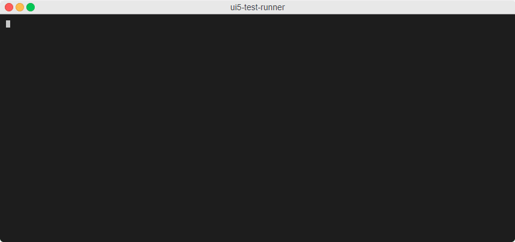

# UI5 Test Runner version 4.5.0

In this article, we will assume that the reader has no knowledge of UI5 or testing. Hence the first two parts will make a **brief summary** of the framework and a **rapid overview** of testing strategies when developing UIs.

If you are already familiar with these concepts, it is then recommended to jump directly to the last part where `ui5-test-runner` is introduced and the latest version presented.

## UI5

### What is UI5 ?

Because of the name itself, it sounds pretty obvious that UI5 is about **User Interface**.
It's not a mystery, there are many UI development frameworks *(and libraries)* existing for JavaScript.

A quick look to [state of JS](https://2022.stateofjs.com/en-US/libraries/front-end-frameworks/) illustrates that the most used are : [React](https://react.dev/), [Angular](https://angular.io/) and [Vue](https://vuejs.org/).


> State of JS 2022 Front-End Frameworks ranking

Then what is UI5 and why is it relevant ?

[](https://www.youtube.com/watch?v=6_CQYtmRJNg)

> Presentation video of "What is SAPUI5?"

To quote the above video description : *SAPUI5 is an HTML5 framework for creating cross-platform, enterprise-grade web applications in an efficient way*.

This framework was first released in 2012. To summarize its core values :

* It is **responsive** and offers a **consistent user experience** across devices,
* It contains hundreds of **standardized components** to build **enterprise-grade** applications,
* It relies on **robust development concepts**, such as :
  * Object Oriented Programming,
  * Model-View-Controller pattern,
  * Data source bindings,
  * Translation & Internationalization,
  * Extensibility,
  * ...

And it comes with a **different paradigm** : instead of letting the developers struggle with HTML *(like most popular frameworks)*, this one is **widget-based**. It means that the developer focuses more on building the user interface in terms of **assembling components** rather than fine tuning HTML and CSS to create a decent look.

The following example illustrates how to design login screen with an XML syntax.

```xml
<core:View height="100%" controllerName="app.controllers.login" xmlns="sap.m" xmlns:core="sap.ui.core">   
  <Page id="loginPage" enableScrolling="false" title="{i18n>LoginPageTitle}">
    <VBox fitContainer="true" justifyContent="Center" alignItems="Center">
      <Label id="lblLogin" text="{i18n>Login}" labelFor="inpLogin" />
      <Input id="inpLogin" editable="true" />
      <Label id="lblPassword" text="{i18n>Password}" labelFor="inpPassword" />
      <Input id="inpPassword" type="Password" editable="true" />
      <Button id="bntLogin" text="{i18n>Login}" press="onLogin" />
    </VBox>
  </Page>
</core:View>
```

> Login View expressed in XML

### A growing ecosystem

The UI5 framework exists in two flavors :

* [Open UI5](https://github.com/SAP/openui5) : the **open source** version *(which was first released in 2013)*, distributed under the [Apache License 2.0](https://github.com/SAP/openui5/blob/master/LICENSE.txt),
* [SapUI5](https://ui5.sap.com/) : the **enterprise version** which basically *extends* open UI5 with more controls.

A [growing ecosystem](https://ui5-community.github.io/ui5-ecosystem-showcase/) of tools and helpers makes it easier to build new applications with UI5.
In particular, the following tools are **almost required** for any new development.

#### UI5 Tooling

Also known as the `@ui5/cli` tool *(which is the NPM package name to install)*, this command line regroups a [collection of tools](https://sap.github.io/ui5-tooling/v3/) to help **setup, run and build** UI5 applications.

For local development, the application is served with the command `ui5 serve`. A configurable list of [middlewares](https://sap.github.io/ui5-tooling/v3/pages/Server/) can be setup to **alter** the server behavior. For instance :

* The backend can be **mocked** to simulate API calls,
* Source files can be **instrumented** on the fly to collect the code coverage while running the tests,
* ...

In the following example, the `@ui5/middleware-code-coverage` is used to enable code coverage consolidation while running tests.

```yaml
specVersion: '3.0'
metadata:
  name: training-ui5con18-opa
type: application
server:
  customMiddleware:
  - name: "@ui5/middleware-code-coverage"
    afterMiddleware: compression
    configuration:
      instrument:
        produceSourceMap: true
        coverageGlobalScope: "window.top"
        coverageGlobalScopeFunc: false
      excludePatterns:
        - "test/"
        - "resources/"
```

> `ui5.yaml` configuration file declaring the `@ui5/middleware-code-coverage` middleware

#### TypeScript support

The framework is now **supporting TypeScript** with the help of additional tools. For instance, the framework implements a specific dependency injection method ([`sap.ui.require`](https://ui5.sap.com/#/api/sap.ui%23methods/sap.ui.require)) which can be **transpiled from** the `import` statement.

TypeScript **completes** UI5 perfectly as every control is clearly **defined and documented**. Hence, UI5 publishes [type definitions](https://www.npmjs.com/package/@types/openui5) for its libraries.
This way, the development environment benefits from auto-completion and, while transpiling, the code is being validated against types.


> Auto completion and validation in VS Studio

All the documentation about how to use TypeScript in UI5 can be found [here](https://sap.github.io/ui5-typescript/).

## Test

Test pyramid


The framework also comes with two testing frameworks :

* qUnit used for unit testing, can also 
* OPA used for component & integration testing 


### Karma

In order to execute these tests in a CI/CD pipeline, a karma runner was customized to support UI5 specificities

> https://www.npmjs.com/package/karma-ui5

Problems :


### UI5 Test Runner

Security : https://security.snyk.io/package/npm/ui5-test-runner

## Runner

### Installation

`ui5-test-runner` is available as a [NPM package](https://www.npmjs.com/package/ui5-test-runner) and can be installed either globally or locally to a project. For the sake of simplicity, in the rest of the article, we consider it to be installed globally.


> `npm install ui5-test-runner --global`

Almost no dependencies, very small package
https://packagephobia.com/result?p=ui5-test-runner

Additional dependencies are added on-demand, only if not found locally.

### First run

For instance, the `--capabilities` option triggers a suite of tests that validates the use of a browser. By default, `puppeteer` is used as shown in the following example.


> `ui5-test-runner --capabilities`


### Remote mode

Demo with ui5 samples

### Legacy mode

## What's new in version 4.5.0

### OPA tests performances

### Fixes and project structure

Who would decently create a test runner without making sure that it is fully tested ?