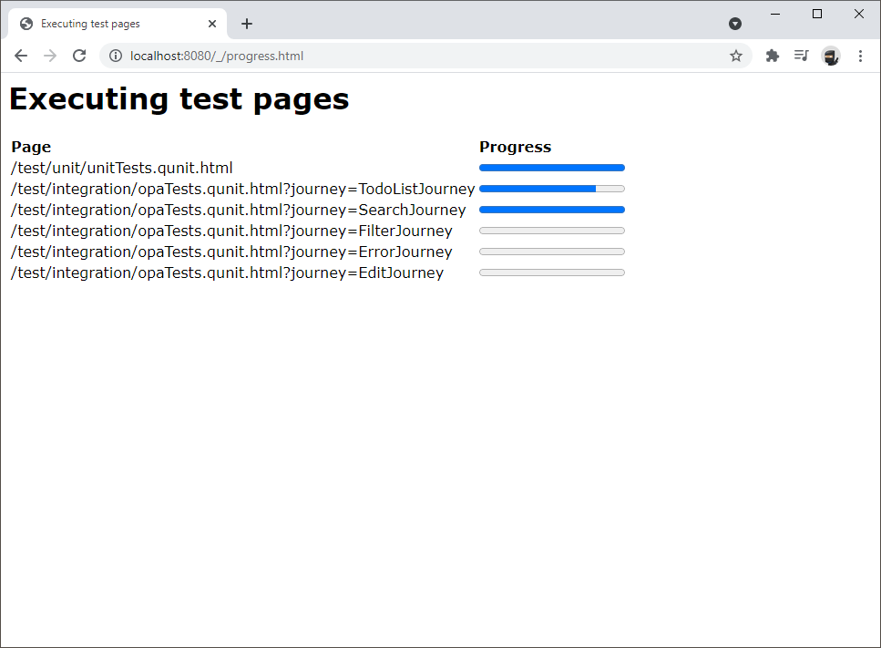
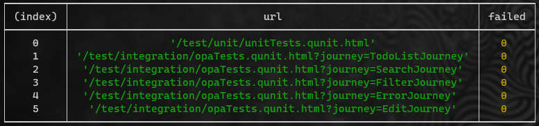
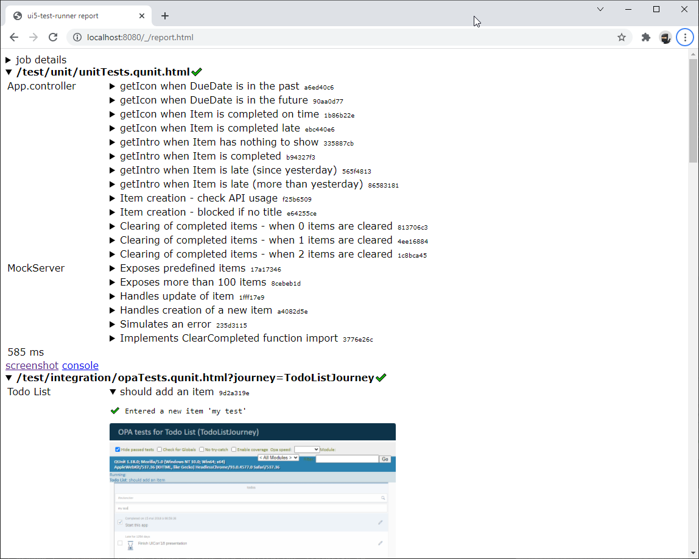
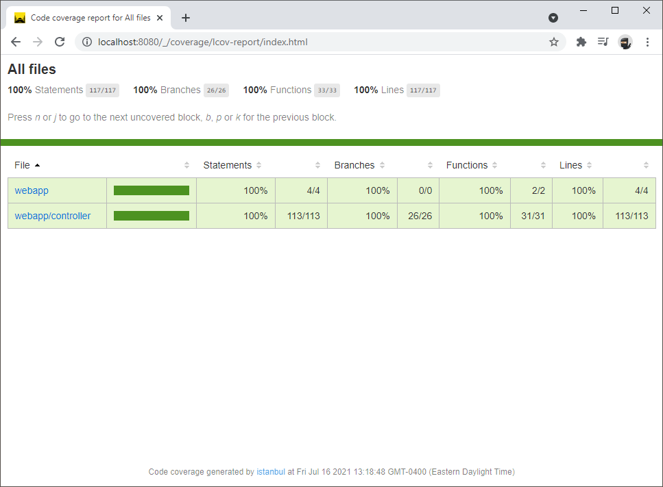

# Running and testing the application *(a.k.a. legacy mode)*

## Overview

`ui5-test-runner` can **serve** the application while testing it. It means that it delivers the application files through its **web server**.

This mode offers interesting and unique capabilities :
* Selecting the UI5 version to use,
* Caching the UI5 resources to speed up the tests,
* Mapping of libraries,
* Code coverage measurement.

## Step by step

* Clone the project you want to test
* If the project owns library dependencies *(other than UI5)*, you must also clone them.<br/>
  To check for project dependencies, you may look into :
  - `POM.xml` *(for maven based builds)* :
  ```xml
	<dependencies>
		<dependency>
			<groupId>com.sap.fiori</groupId>
			<artifactId>my.namespace.feature.project.lib</artifactId>
			<version>...</version>
		</dependency>

  ```
  - `manifest.json` file :
  ```json
  {
    "sap.ui5": {
		"dependencies": {
			"libs": {
				"my.namespace.feature.lib": {
					"lazy": true
				}
	```

> The following assumes that the project and its dependencies are cloned in **the same** folder. You **must** handle the **differences** between the library **project name** / **structure** and the **namespace** it implements.

* In the project root folder, run the following command :

`ui5-test-runner --port 8080 --cache .ui5 --libs my/namespace/feature/lib/=../my.namespace.feature.project.lib/src/my/namespace/feature/lib/`

The list of options is available using `ui5-test-runner --help` but to explain the command :
* `--port 8080` : uses the fixed http port `8080`

* `--cache .ui5` : caches UI5 resources to boost loading of pages. It stores resources in a project folder named `.ui5` *(you may use an absolute path if preferred)*.

* `--libs my/namespace/feature/lib/=../my.namespace.feature.project.lib/src/my/namespace/feature/lib/` : maps the library path (access to URL `/resources/my/namespace/feature/lib/library.js` will be mapped to the file path `../my.namespace.feature.project.lib/src/my/namespace/feature/lib/library.js`)

You may also use :
* `--ui5 https://ui5.sap.com/1.109.0/` : uses a specific version of UI5

* `--no-coverage` : **ignores**  code coverage measurement *(if you don’t need it, it speeds up a bit the startup)*

* `"-args:__URL__ __REPORT__ --visible"` : changes the browser spawning command line to make the browser windows **visible**

* `--parallel 3` : increases *(changes)* the number of parallel execution *(by default it uses 2)*. You may even use `0` to only serve the application *(the tests are not executed)*.

* `--keep-alive` : the server remains active after executing the tests

  - It is a nice way to run the tests in your own browser.<br/>For instance, open http://localhost:8080/test/unit/unitTests.qunit.html

  - It might be interesting to keep it running to access the detailed report *(see below)*


**During** the test executions *(which can take some time)* you can monitor the progress by opening : http://localhost:8080/_/progress.html

  

**After** the tests are executed :

* The command line output will provide a summary of executed pages and the corresponding failures :

  

* The detailed test report is available from http://localhost:8080/_/report.html *(since it uses requests to load the details, the report **must** be open through a web server, don't try to open the .html from the file system... it won't work)*

  

* The coverage report is available from http://localhost:8080/_/coverage/lcov-report/index.html

  


* Some folders are created to support execution, you may add them to your project `.gitignore` to exclude them from git :

  - `.nyc_output/` : contains coverage information

  - `report/` : contains test report *(as well as screenshots and console log outputs)*

  - `.ui5/` : contains cached UI5 resources

  - These folder names can be changed through parameters *(see the list below)*

## Parameters

To access the list of parameters, use `ui5-test-runner --help`.
