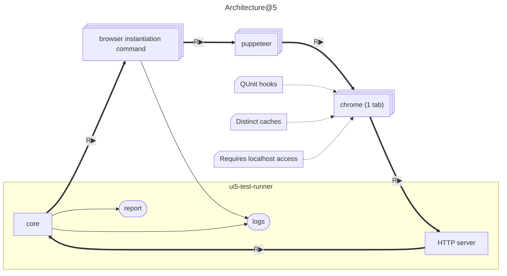
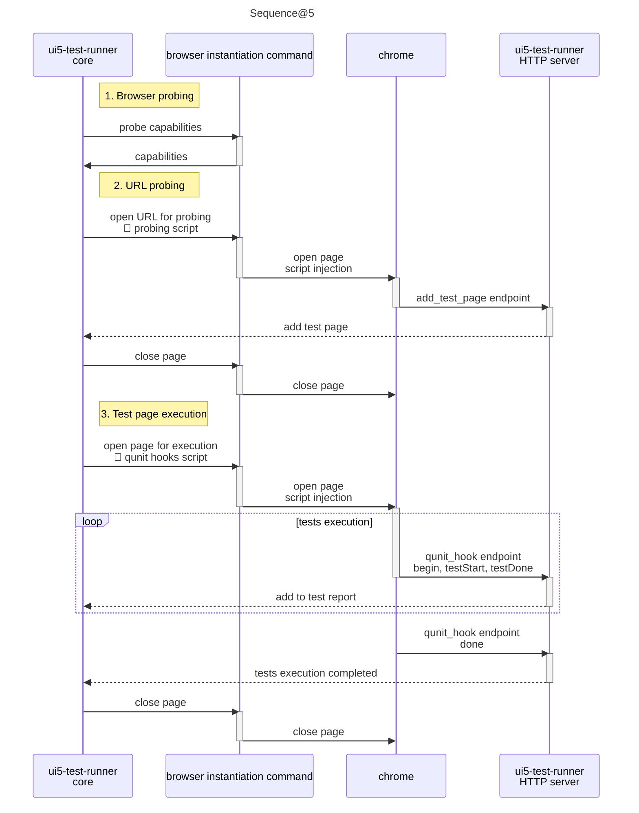
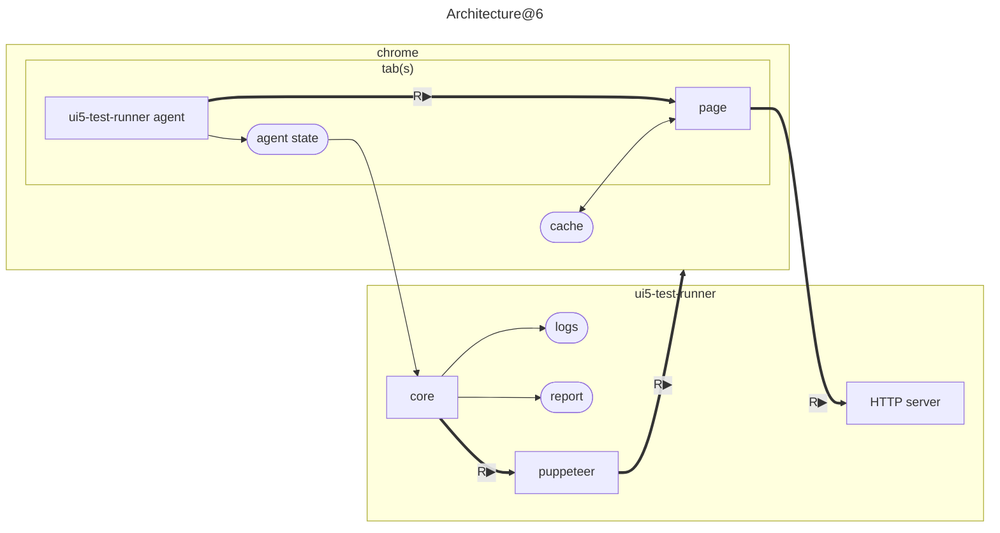
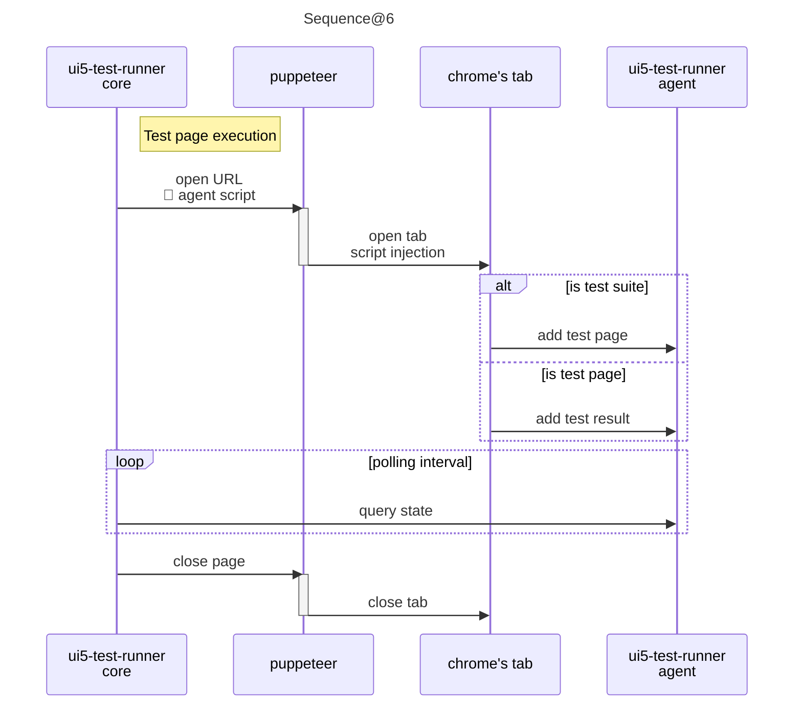

# 2026 DCOM

## Submission

**Session title:** UI5 Test Runner version 6
**Session description:** 

Big news for the UI5 community! ui5-test-runner version 6 is around the corner, and it’s a game changer.

It is completely rewritten in TypeScript to make the testing workflows faster and more efficient than ever.

What’s new?
✅ Speed enhancements,
✅ Reliable execution,
✅ CTRF (Common Test Report Format) output for seamless integration,
✅ Improved (and centralized) tracing,
✅ Brand new documentation system.

The presentation will consist in :
- Deep diving into the pain points of version 5,
- Unveiling the solutions engineered for version 6,
- An exclusive first look at the near-ready build,
- Showcasing how AI has been leveraged to increase the development velocity.

Come and share your feedback to help shape the future of UI5 testing.

**Session length:** 25-min Tech Talk

## Plan

* Current state
  - Downloads / month
  - Project metrics (source, issues, bugs rate)
  - Performance

* Reasons for refactoring
  - Maintainability issues : JavaScript, poor tracing, poor documentation
  - Troubleshooting issues : poor tracing (needs to be enabled), not able to detect when the browser fails (explain the POST model)
  - Security issues : latest chrome does not allow access to localhost from an URL
  - Performance : requires probing THEN execution, each browser is a separate process, needs external cache
  - Old dependencies (commander, pidtree, ...)

* Solutions
  - TypeScript : use interfaces, improved linting
  - Documentation as Code
  - Use of well documented formats (CTRF)
  - Unified tracing system
  - Technical platform (threads, mocking)
  - Improve browser spawning, use multiple tab, native browser cache, use of a JS evaluation and browser agent (explain the POLL model)
  - No more need for probing !

* Demo (work in progress)

* Use of AI
  - More UIs using a strict separation of concern between controller and UI rendering
  - Conversion of CTRF to anything

## Current State

(Picture of npmjs.com/ui5-test-runner)

### Code metrics

Measures realized with [sabik](https://www.npmjs.com/package/sabik).

| |@5|@6 (1️⃣)|
|-|--|--|
|Language|JavaScript|TypeScript|
|[Cognitive complexity](https://en.wikipedia.org/wiki/Cyclomatic_complexity)|6.72|2.36|
|[Cyclomatic complexity](https://www.sonarsource.com/docs/CognitiveComplexity.pdf)|4.19|2.26|
|[Maintainability](https://docs.microsoft.com/en-us/visualstudio/code-quality/code-metrics-maintainability-index-range-and-meaning?view=vs-2019)|82.58|84.64|
|[Bugs delivered](https://en.wikipedia.org/wiki/Halstead_complexity_measures) (2️⃣)|54.26|35.74|
|Lines of code|11605|10862|

1️⃣: Temporary data, the project is not completed

2️⃣: On average, software projects tend to experience between 15 to 50 bugs per 1,000 lines of code.

### Performance

In theory, parallelization makes `ui5-test-runner` run faster, but...

* Starting a new instance of a browser takes time
* There are lots of issues related to UI5 resources that must be cached
* On simple tests (QUnit), I got feeback from teams saying `karma` is faster.

Parallelization does not "scale" well

In the end, performance is only the tip of the iceberge.

### OpenUI5

The OpenUI5 challenge (31K+ tests, lots of suites)

#### Work Mac

Takes 39 minutes with Karma
Down to 10 minutes with ui5-test-runner@5 (10 parallel) but required a lot of tweaking (deep probing, batching of updates)

With ui5-test-runner@5
parallel: 10 / probe-parallel: 20 : 36 min
parallel: 4 / probe-parallel: 10 : 32+ min (stopped after 69%)

With ui5-test-runner@6
parallel: 4 / 23 min

#### Home PC

With ui5-test-runner@5
parallel: 10 / probe-parallel: 20 : 34 min

With ui5-test-runner@6
parallel: 10 / 24 min
parallel: 4 / 32 min

## Reasons for refactoring

### Maintainability

I am the only developper on this project, I frequently receive issues.

  - Maintainability issues : JavaScript, poor tracing, poor documentation

### Troubleshooting

  - Troubleshooting issues : poor tracing (needs to be enabled), not able to detect when the browser fails (explain the POST model)

### Browser evolution

  - Security issues : latest chrome does not allow access to localhost from an URL

### Execution scheme

  - Performance : requires probing THEN execution, each browser is a separate process, needs external cache

### Dependencies

  - Old dependencies (commander, pidtree, ...)

### Architecture@5

Group browser + puppeteer + tab and make this group multivaluated

### Sequence@5

full line for http to core

## Solutions

### Architecture@6

puppeteer should point to tab and not to browser

### Sequence@6

## Notes

I have been developing ui5-test-runner for the last five years and the development has been chaotic in order to support all the different requirements. The evolution of the tool is not what I expected.
Indeed, in many occasions after adding some little features, I faced some bugs which were not expected mostly because of the complexity of the current architecture.

the need for evolution.

There are several major problems in the current implementation.
The codebase is written in JavaScript change code to code
Even if itself is not a problem the fact that the codebase has grown quite loudly as a result, it’s pretty difficult to remember all the types and structures which are being used since they are not clearly defined.
Furthermore, some bugs appeared because of non strict checking of the inputs received during the function calls

Traces

Another problem is the management of outputs logs. There is one huge file called output.js, which was initially aimed to centralize all the outputs of the tool, but as usual, it went out of control, and the file itself contains more than necessary, making it very difficult to maintain.
Also the to tool spawn lots of processes on each of them after their own outputs as a result when you need to qualify an issue, it’s pretty difficult to consolidate the traces and the solution would be to generate one big trace file that contains everything and that can be searched using attributes.

Also, performance wise file access needed to serialize the traces slows down the main process of the runner. I recently learned that threads could be used in process in order to tackle those performance issues.

browser automation.

Another aspect of the runner which I am not happy with is The way browser automation is integrated with it. They are two main problems first, they require the execution of an external command, this was initially designed to ensure that any problem occurring in one test will not affect the other test yet 99% of the time this barely happens. The reason is that when the tool was initially developed, I had the karma reference which execute all the test in the same browser as a result, the page could reach the limit of 2 GB of memory being used crashing the whole system.
Ui5-test-runner on the other hand executes the pages one by one eventually they can be parallelized but as a consequence, we can barely reach 2 gigabytes of memory since once a page is completed the memory allocated for it is released, so it might be interesting to experiment to see if removing the additional process execution with gain time indeed, it was observed that when a lot of pages are being executed almost 2 seconds are lost every time to just to start the browser aspect which needs to be considered as the fact that it’s not required to start a new browser for each page instead, a new tab could be opened with the browser.
There are many advantages to the solution first of all caching the UI resources. I’m not cashed by default which means every browser since they are in isolated environment need to reload those resources in order to start the application.
I need to do some experiments to validate that if the same browser is being used with several tabs cashing would be effective inside the browser.
But in the end, another advantage of using a single browser with multiple tabs is that you eliminate the need for the two second start up every time a new bitch needs to be executed. The risk on the other hand is that if one tub crashes the browser or the test are failing, but that is already under by the runner which means if a test fails then the test is executed. In that case there could be a mechanism that found under the browser if that situation happens

maintainability and support.

I am the only one maintaining the tool. I a not complaining but it reaches 10k download per weeks and I get lot of feedback every week.

The plan

Use typescript
Develop in parallel
Use latest NodeJS
Eliminate some dependencies (commander) to reuse node.js built in tool
Improve linting and tests
Simplify architecture (clear interfaces, threads rather than processes…)
Isolate coverage !

# Slides

## Intro

* 20,000 downloads per week

* ~100 teams depend on `ui5-test-runner`

* 1 maintainer

> *"Last year, I faced a choice: Keep adding band-aids to JavaScript spaghetti, or rebuild from scratch. I chose to rebuild. Here's what I learned—and why it matters for anyone maintaining critical open-source tools."*

## The Problems

### The 500-line Parameters Parser

[job.js](https://github.com/ArnaudBuchholz/ui5-test-runner/blob/5.x.y/src/job.js)

* 💡 No type **safety** = silent failures that **waste** hours

> *"When I added the 'start' option, it conflicted with the internal 'start' time tracking. I spent 3 hours debugging why tests were showing wrong timings."*

### The Tracing Nightmare

* *"Tests are **failing** on CI but not on our machines"*

* Troubleshooting workflow :
  1. Enable traces (through options)
  2. Re-run the tests *(and wait)*
  3. Collect the trace files
  4. Trying to make sense out of the **cluttered** traces
  5. Loop to 1

* 💡 The tool does not **tell** what happened by default and traces are hard to **analyze**

### The Security Trap

* Recent Chrome changes broke `localhost` access from remote URLs

* Workaround : **disable** browser security

* 💡 Not **scalable**, not **safe**, and erodes **trust**

### The Speed Ceiling

* The claim is : *"Faster than Karma"*

* Reality check : some teams can not **parallelize** their tests

* The tool has overhead that **neutralizes** parallelization gains :
  * spawning a process is **expensive**
  * monitoring test execution through HTTP post is a **waste** of time

* 💡 parallelization is implemented in an **inefficient** way

### The Maintenance Trap

* 1 issue / month does not sound bad

* Each issue = **hours** of investigation

* 💡 No one else can **confidently contribute** *(code is brittle)*

## The Decision & Strategy

### The Three Options

* Keep patching : ❌ unsustainable
* Onboard another maintainer : ❌ code is hard to maintain
* Rebuild with guardrails : ✅

### The Bet

* 6 months of development to :
  * save **thousands** of hours downstream
  * open the door for **futur improvements**
  * enable knowledge transfer and **onboard** new maintainers

### Three Pillars of the Rebuild

1. **Reliability** : Traces that tell the whole story automatically
2. **Speed** : Remove overhead, improve parallelization model
3. **Shareability** : Code that someone else can actually maintain

## The Solutions

### The 500-line Parser is a Ticking Time Bomb

TypeScript + proper interfaces:

CLI options are now type-validated at parse time
The "start option conflict" can't happen because the type system prevents it
Concrete win: Zero conflicts, even with 50+ options

* Before

* After

### Silent Failures & Debugging Hell

The runner is built like a micro-service, meaning it logs everything.

### Performance Overhead & Security

* Old architecture :
  * Spawn browser → Wait for readiness check (probe) → Run tests
  * Each browser is a separate process
  * External cache means re-downloads

* New architecture: :
  * One browser, multiple tabs
  * Native browser cache
  * JS evaluation engine + agent eliminates probe step

Result : 30% faster on complex suites

### Maintainability & the AI Wildcard

> *"During development, I experimented with AI for UI generation."*

Story 1: The AI Win

Generated UI interfaces from text wireframes
Saved weeks of manual UI coding
All UIs now follow strict separation of concerns (controller ↔ rendering)

Story 2: The AI Failure

"I tried letting AI build the entire browser spawning logic."
Generated plausible-looking code that had subtle race conditions
Learning: AI is brilliant at scaffolding + boilerplate; dangerous for orchestration
Guardrails I built:

AI writes component UIs (high leverage, low risk)
AI suggests but doesn't write critical paths (browser lifecycle, state management)
AI writes tests first, then code
Always pair AI output with code review

## Demo

## The Vision

### What's Coming

* Onboard maintainers : Code is **readable**, **testable**, **contributable**
* Bug fixes : Can be handled by **community**
* New features : Built on a **stable** foundation
* AI tooling : More UIs, more **automation** (with guardrails)

### Some Numbers

Measures realized with [sabik](https://www.npmjs.com/package/sabik).

| |@5|@6 (1️⃣)|
|-|--|--|
|Language|JavaScript|TypeScript|
|[Cognitive complexity](https://en.wikipedia.org/wiki/Cyclomatic_complexity)|6.72|2.36|
|[Cyclomatic complexity](https://www.sonarsource.com/docs/CognitiveComplexity.pdf)|4.19|2.26|
|[Maintainability](https://docs.microsoft.com/en-us/visualstudio/code-quality/code-metrics-maintainability-index-range-and-meaning?view=vs-2019)|82.58|84.64|
|[Bugs delivered](https://en.wikipedia.org/wiki/Halstead_complexity_measures) (2️⃣)|54.26|35.74|
|Lines of code|11605|10862|

1️⃣ : Temporary data, the project is not completed

2️⃣ : On average, software projects tend to experience between 15 to 50 bugs per 1,000 lines of code.

## Key Take-Aways

> *"This wasn't really about TypeScript. It was about asking: 'How do I build something 100+ teams depend on, maintain it myself, AND make it good enough for others to maintain too?'"*
> 
> *"The answer wasn't a silver bullet. It was: Go fast on what matters (speed, reliability), go slow on what's risky (AI generation in critical paths), and build for humans first."*
> 
> *"If you're maintaining something at scale—open source or not—the refactor isn't the end goal. Sustainability is."*
