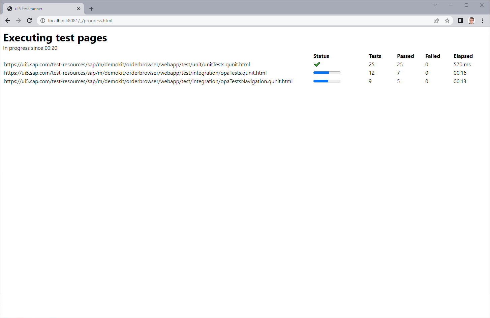
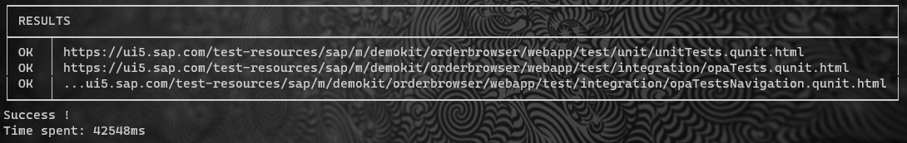
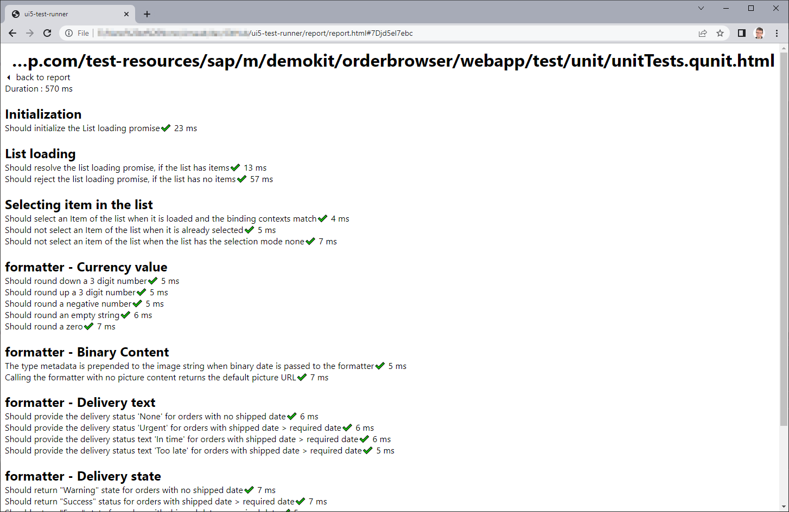

# Testing a "remote" application

## Overview

With version 2, `ui5-test-runner` can test applications that are **already** served.

This addresses the limits of the [legacy mode](legacy.md) :
* It is compatible with [@ui5/cli](https://sap.github.io/ui5-tooling/v3/pages/CLI/),
* The application may have special requirements to be tested: this is **externalized** from the runner,
* More than one application can be tested at the same time.

On the flip side, it does **not** enable these features :
* Selecting and caching the UI5 version,
* Measuring the code coverage.

## Step by step

* Start your application, let's assume that it is available from `https://ui5.sap.com/test-resources/sap/m/demokit/orderbrowser/webapp/test/testsuite.qunit.html`
* Run the following command :

`ui5-test-runner --port 8081 --url https://ui5.sap.com/test-resources/sap/m/demokit/orderbrowser/webapp/test/testsuite.qunit.html`

**During** the test executions *(which can take some time)* you can monitor the progress by opening : http://localhost:8081/_/progress.html

  

**After** the tests are executed :

* The command line output will provide a summary of executed pages and the corresponding failures :

  

* The detailed test report is available in the report folder

  

* The folder `report/` is created to support execution, you may add it to your project `.gitignore` to exclude it from git